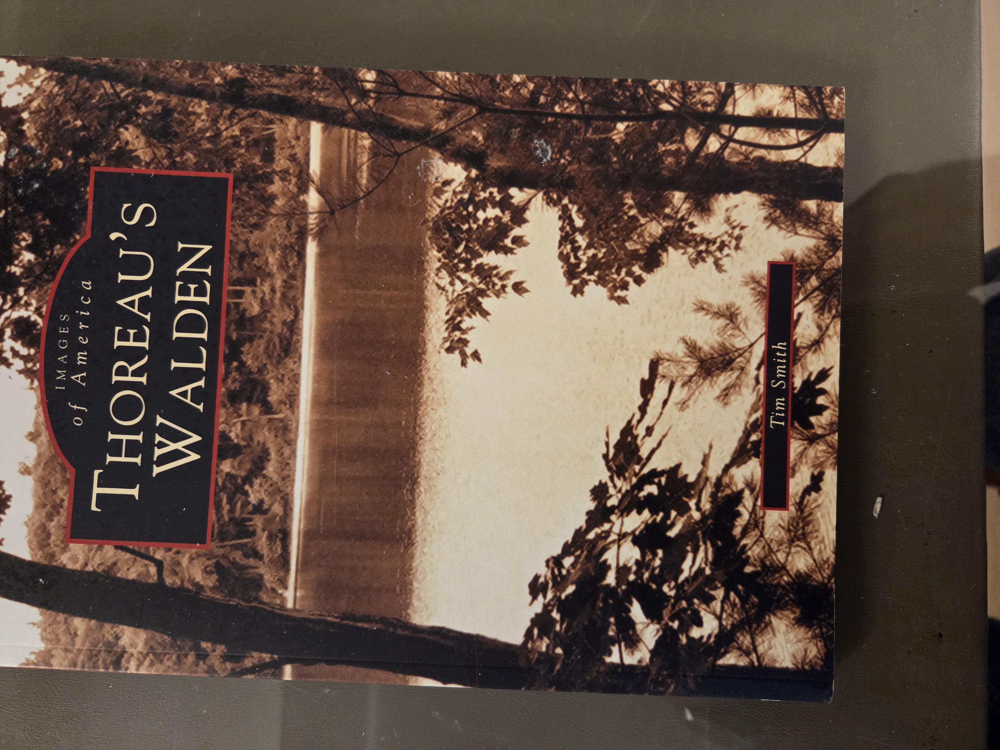
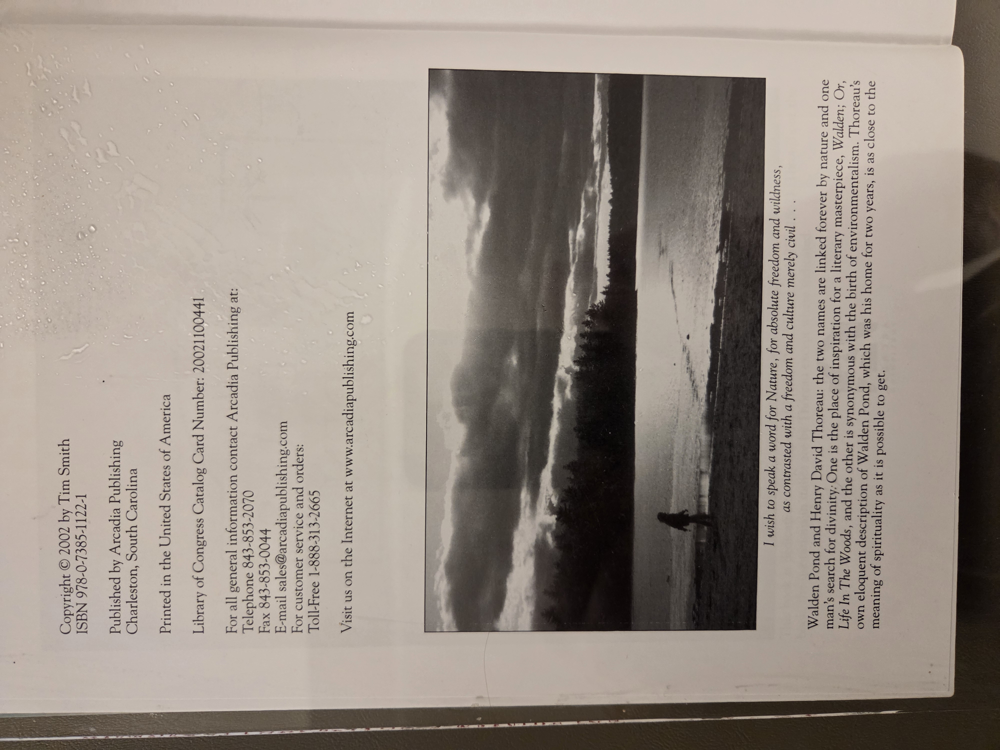
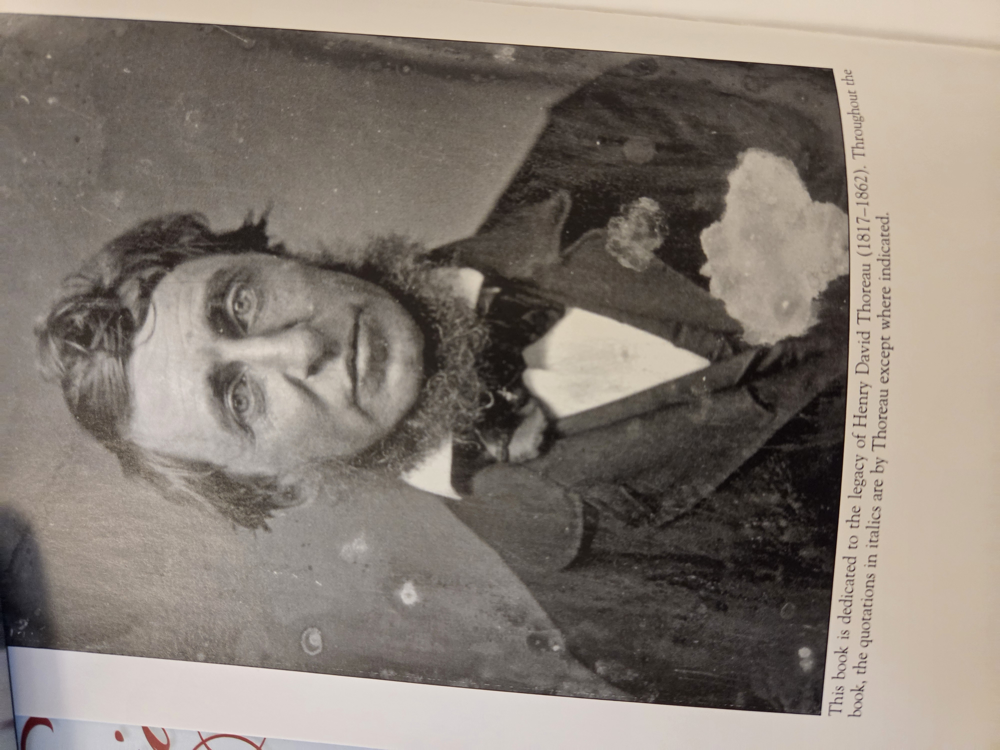
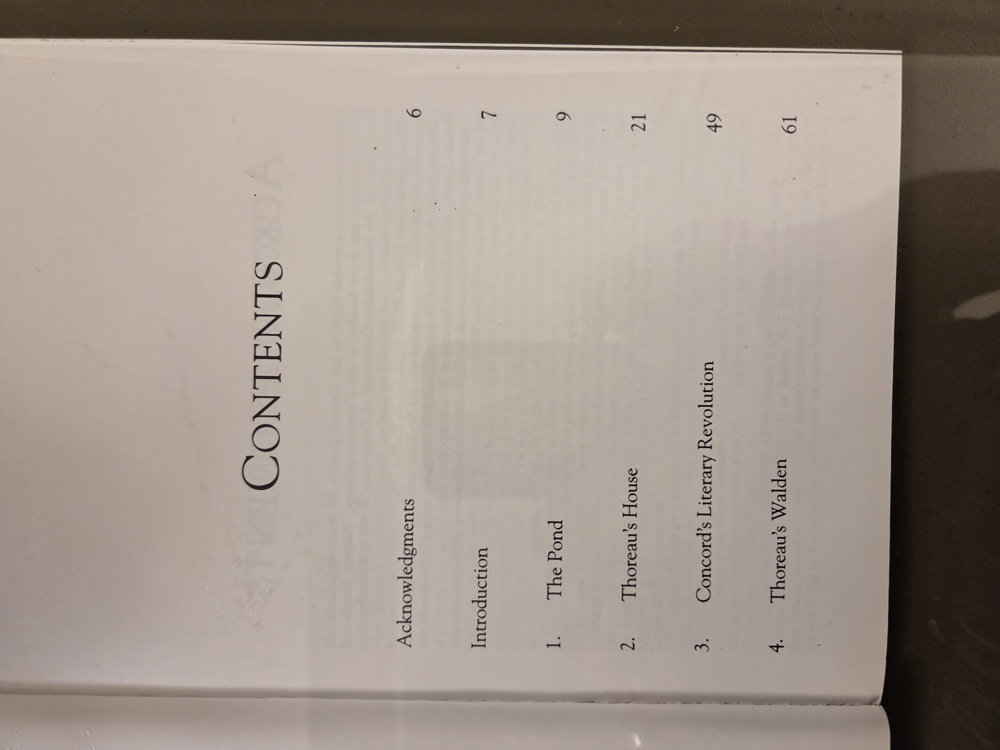

# Thoreau’s Walden

**Author:** Tim Smith  
**Publisher:** Arcadia Publishing  
**Imprint:** Images of America  
**Publication Year:** 2002  
**ISBN:** 978-0-7385-1122-1  
**Library of Congress Catalog Card Number:** 20021100441  
**Place of Publication:** Charleston, South Carolina  
**Printer Location:** United States of America  

## UDC Classification

**Primary Category:** Biography, Local History, Environmental Studies  
**Keywords:**  
- Walden Pond — Concord, Massachusetts  
- Thoreau, Henry David (1817–1862)  
- American Transcendentalism — Concord  
- Literary history — Concord authors  
- Conservation and nature appreciation — Massachusetts  
- Arcadia Publishing — Images of America series  

## Table of Contents

- Acknowledgments — p.6  
- Introduction — p.7  
1. The Pond — p.9  
2. Thoreau’s House — p.21  
3. Concord’s Literary Revolution — p.49  
4. Thoreau’s Walden — p.61  

## Publication Details

**Copyright ©** 2002 by Tim Smith  
All rights reserved. No part of this book may be reproduced or transmitted in any form without written permission.  
For inquiries, contact Arcadia Publishing:  
- Telephone: 843-853-2070  
- Fax: 843-853-0044  
- Email: sales@arcadiapublishing.com  
- Website: [www.arcadiapublishing.com](http://www.arcadiapublishing.com)  
- Toll-Free: 1-888-313-2665  

## Dedication

This book is dedicated to the legacy of Henry David Thoreau (1817–1862). Throughout the book, the quotations in italics are by Thoreau except where indicated.

---

## Image Gallery

📖 Click to display copyright page (optional)

📸 Click to display Thoreau’s portrait (optional)

📑 Click to display table of contents (optional)

