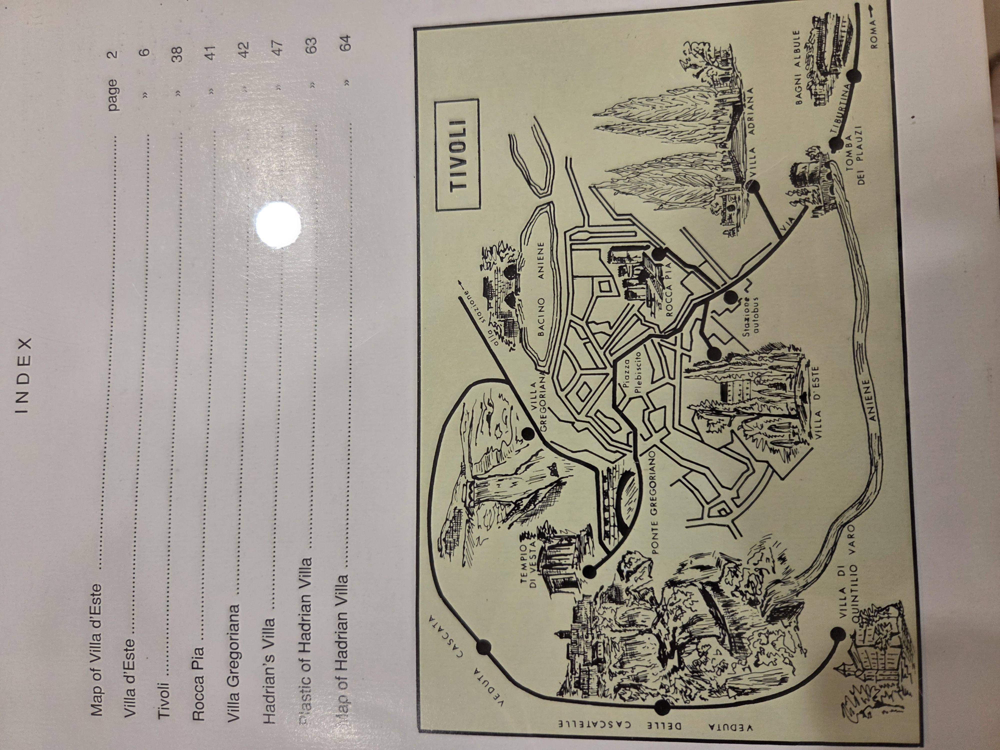
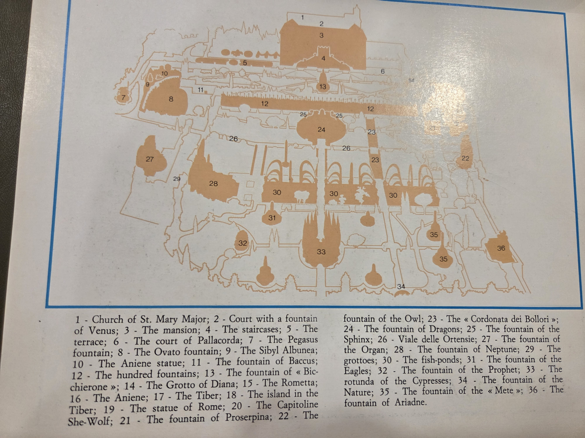
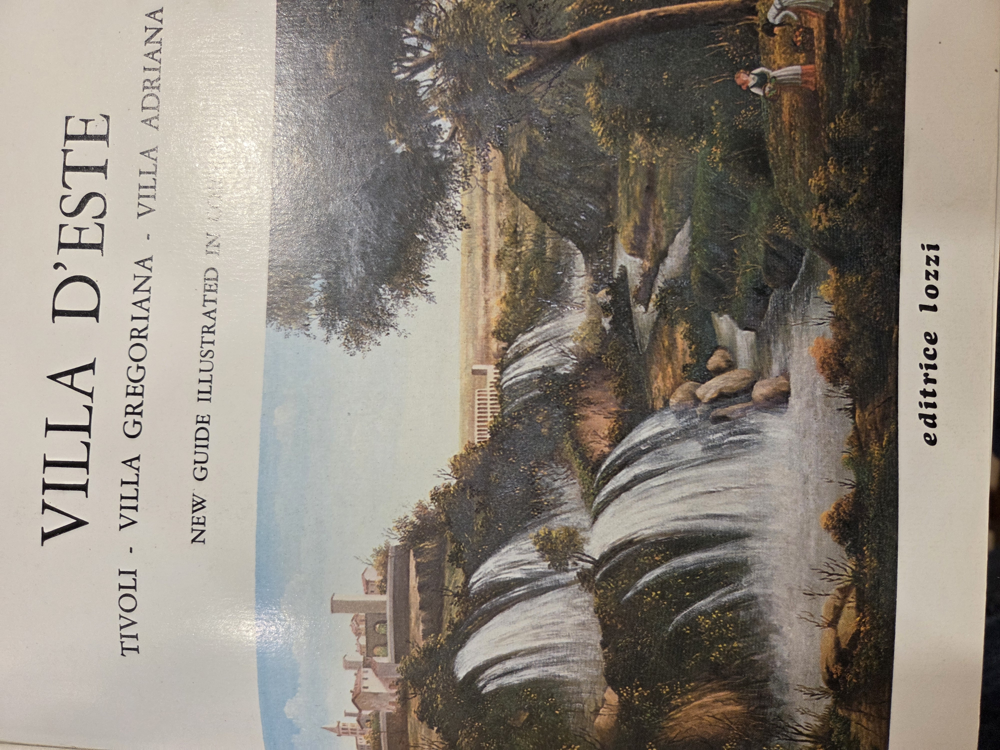
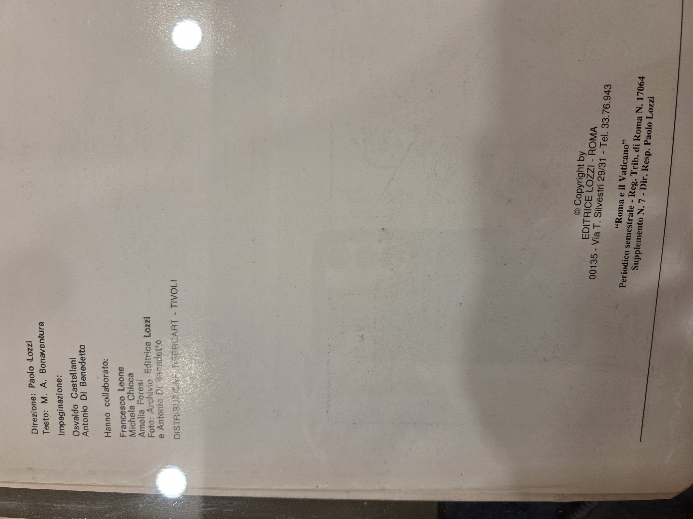

# Villa d’Este  
**Tivoli – Villa Gregoriana – Villa Adriana**  
_New Guide Illustrated in Colour_  
**Editrice Lozzi**

---

---

## Index

1. Map of Villa d’Este – p. 2  
2. Villa d’Este – p. 6  
3. Tivoli – p. 38  
4. Rocca Pia – p. 41  
5. Villa Gregoriana – p. 42  
6. Hadrian’s Villa – p. 47  
7. Plastic of Hadrian Villa – p. 63  
8. Map of Hadrian Villa – p. 64

---

## Garden Features (Map Reference)

1. Church of St. Mary Major  
2. Court with a fountain of Venus  
3. The staircase  
4. The mansion  
5. The terrace  
6. The court of Pallacorda  
7. The Pegasus fountain  
8. The Ovato fountain  
9. The Sibyl Albunea  
10. The Aniene statue  
11. The fountain of Baccus  
12. The hundred fountains  
13. The fountain of Diana  
14. The Grotto of Diana  
15. The Rommetta  
16. The Aniene  
17. The Tiber  
18. The island in the Tiber  
19. The statue of Rome  
20. The Capitoline She-Wolf  
21. The fountain of Proserpina  
22. The fountain of the Owl  
23. The “Cordonata dei Bollori”  
24. The fountain of Dragons  
25. The fountain of the Sphinx  
26. Viale delle Ortensie  
27. The fountain of the Organ  
28. The fountain of Neptune  
29. The grottoes  
30. The fish-ponds  
31. The fountain of the Eagles  
32. The fountain of the Prophet  
33. The rotunda of the Cypresses  
34. The fountain of the Nature  
35. The fountain of the “Mete”  
36. The fountain of Ariadne

---

## Map of Tivoli Sites

Includes:  
- Villa d’Este  
- Villa Gregoriana  
- Hadrian’s Villa  
- Villa of Quintilio Varo  
- Ponte Gregoriano  
- Rocca Pia  
- Piazza Plebiscito  
- Temples and waterfalls

---

## Publication Details

**Direction:** Paolo Lozzi  
**Text:** M. A. Bonaventura  
**Layout:** Osvaldo Castellani, Antonio Di Benedetto  
**Contributors:** Francesco Leone, Michela Chicca, Amelia Foresi  
**Photography:** Archivio Editrice Lozzi, Antonio Di Benedetto

**Published by:**  
Editrice Lozzi – Roma  
Via T. Silvestri 29/31 – Tel. 33.76.943  
_Periodico semestrale – Reg. Trib. di Roma N. 17064_  
Supplemento N. 7 – Director: Paolo Lozzi

