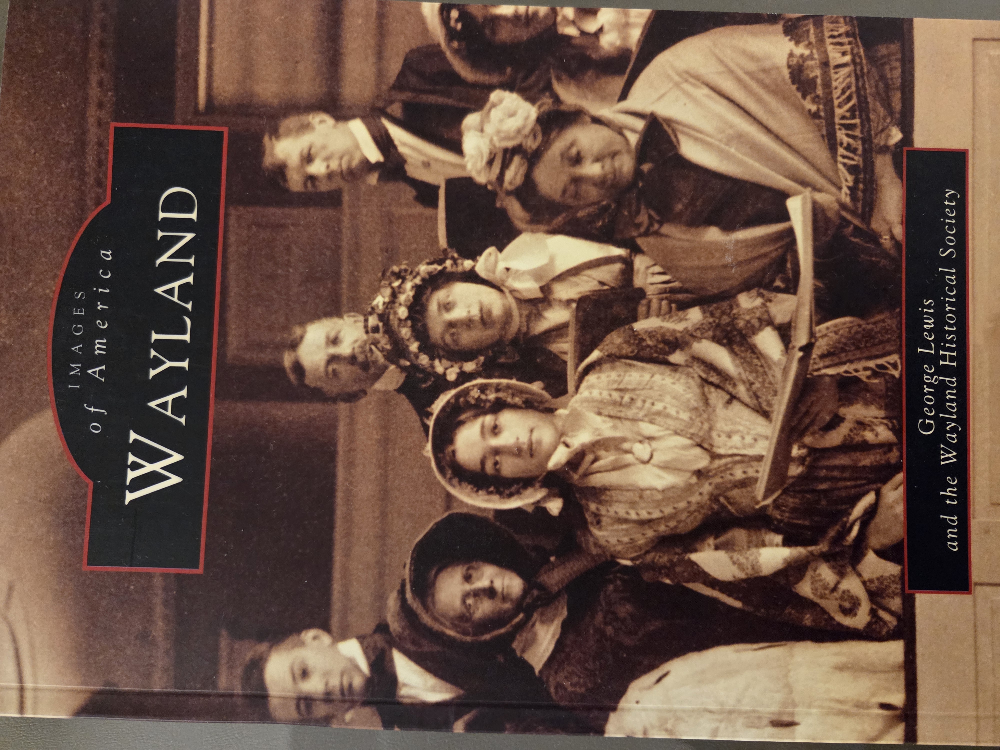
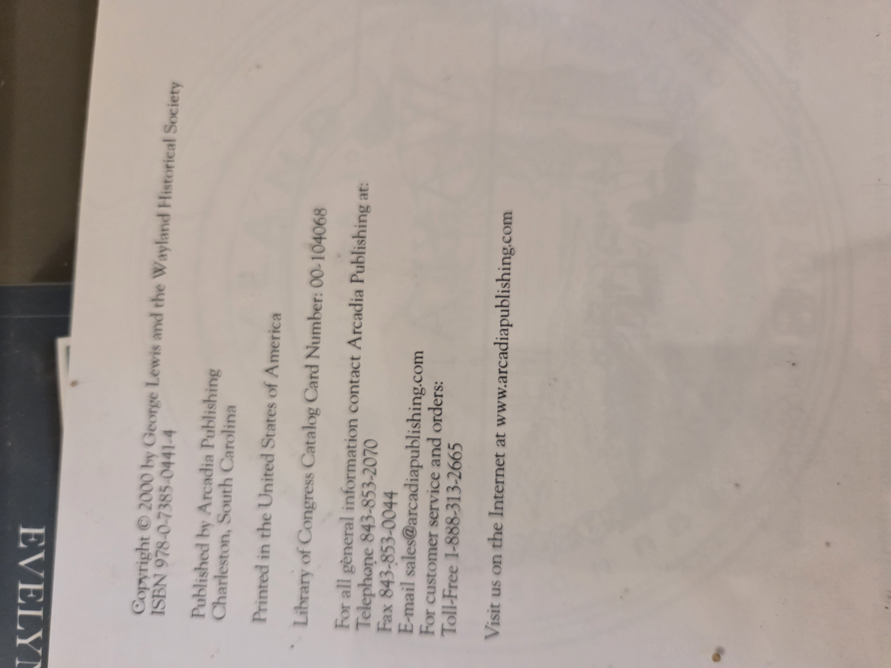
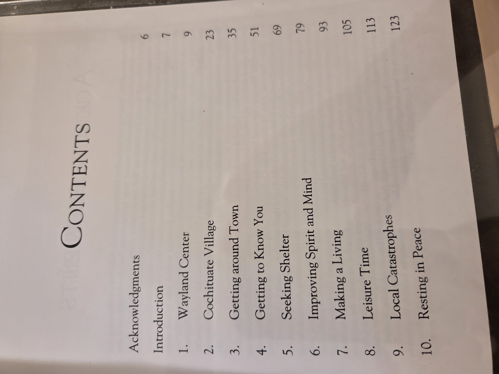
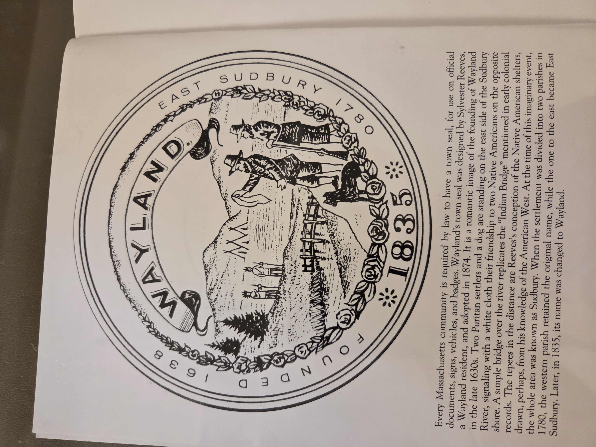

# *Wayland*

**George Lewis and the Wayland Historical Society**  
*Images of America Series*

---

## 📚 UBC Classification

**Primary:** 974.44  
**Secondary:** 910.4′53  
**Keywords:** Massachusetts history, Wayland, local history, town development, Images of America, Arcadia Publishing

---

## 🗂 Table of Contents

**Acknowledgments** — Page 6  
**Introduction** — Page 7  

**1. Wayland Center** — Page 9  
**2. Cochituate Village** — Page 23  
**3. Getting Around Town** — Page 35  
**4. Getting to Know You** — Page 51  
**5. Seeking Shelter** — Page 69  
**6. Improving Spirit and Mind** — Page 79  
**7. Making a Living** — Page 93  
**8. Leisure Time** — Page 105  
**9. Local Catastrophes** — Page 113  
**10. Resting in Peace** — Page 123  

---

<strong>Click to display copyright page (optional)</strong>

<strong>Click to display table of contents (optional)</strong>

<strong>Click to display town seal image (optional)</strong>

---

## 📝 Publication Details

**Published by:** Arcadia Publishing, Charleston, South Carolina  
**Printed in:** United States of America  
**ISBN:** 978-0-7385-0441-4  
**Library of Congress Catalog Card Number:** 00-104068  
**Copyright © 2000** by George Lewis and the Wayland Historical Society

---
