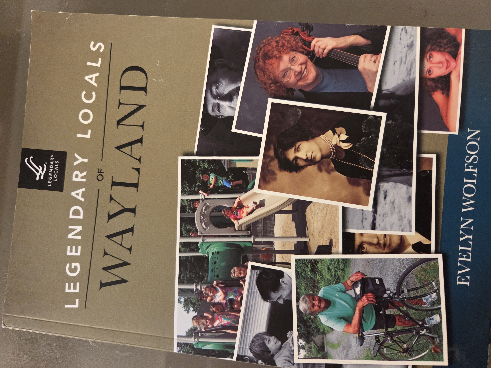
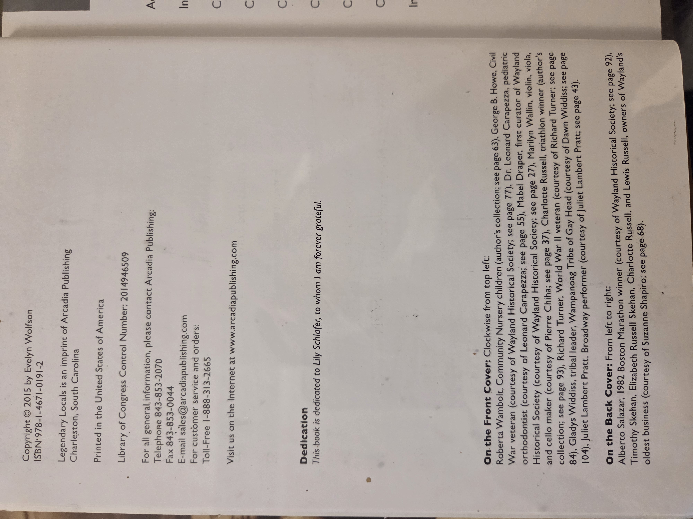
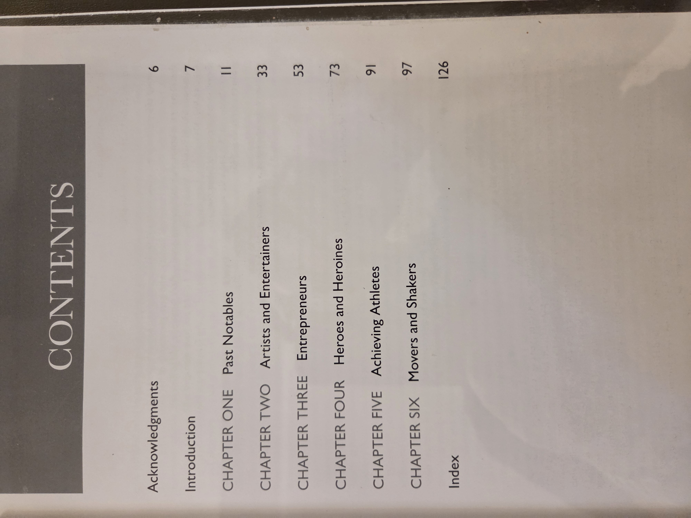

# *Legendary Locals of Wayland*

**Evelyn Wolfson**  
*Legendary Locals Series*

---

## 📚 UBC Classification

**Primary:** 920.0744  
**Secondary:** 920.02  
**Keywords:** Massachusetts biography, Wayland local figures, civic leaders, cultural history, Legendary Locals, Arcadia Publishing

---

## 🗂 Table of Contents

**Acknowledgments** — Page 6  
**Introduction** — Page 7  

**Chapter One: Past Notables** — Page 11  
**Chapter Two: Artists and Entertainers** — Page 33  
**Chapter Three: Entrepreneurs** — Page 53  
**Chapter Four: Heroes and Heroines** — Page 73  
**Chapter Five: Achieving Athletes** — Page 91  
**Chapter Six: Movers and Shakers** — Page 97  

**Index** — Page 126

---

<strong>Click to display copyright page (optional)</strong>

<strong>Click to display table of contents (optional)</strong>

---

## 📝 Publication Details

**Published by:** Arcadia Publishing, Charleston, South Carolina  
**Printed in:** United States of America  
**ISBN:** 978-1-4671-0191-2  
**Library of Congress Control Number:** 2014946509  
**Copyright © 2015** by Evelyn Wolfson  
*Legendary Locals is an imprint of Arcadia Publishing*

---

