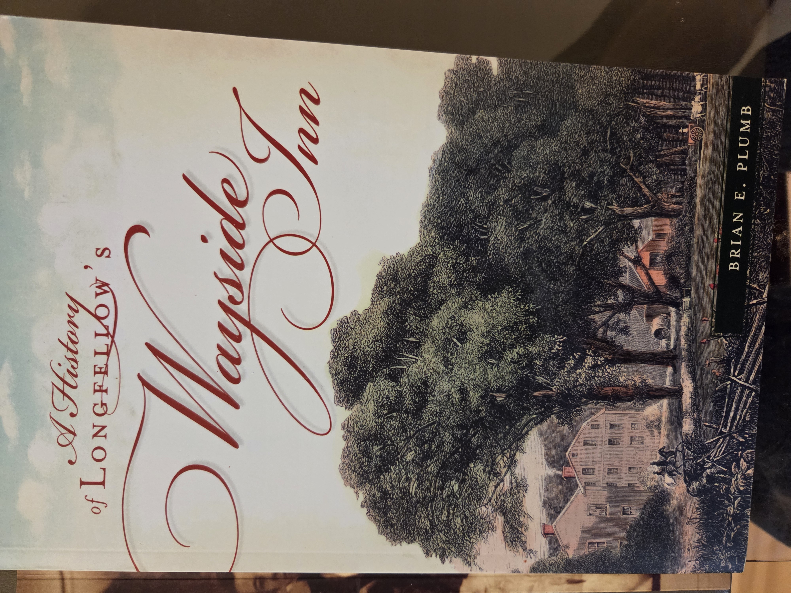
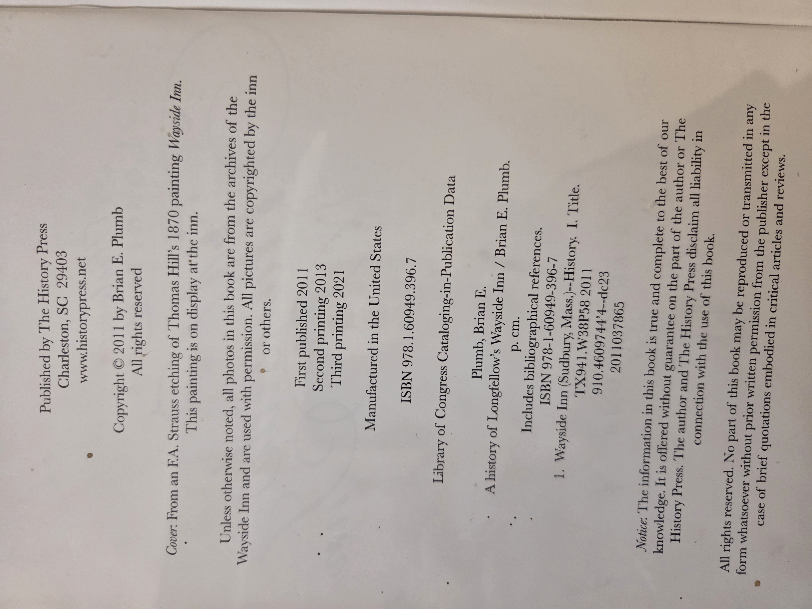
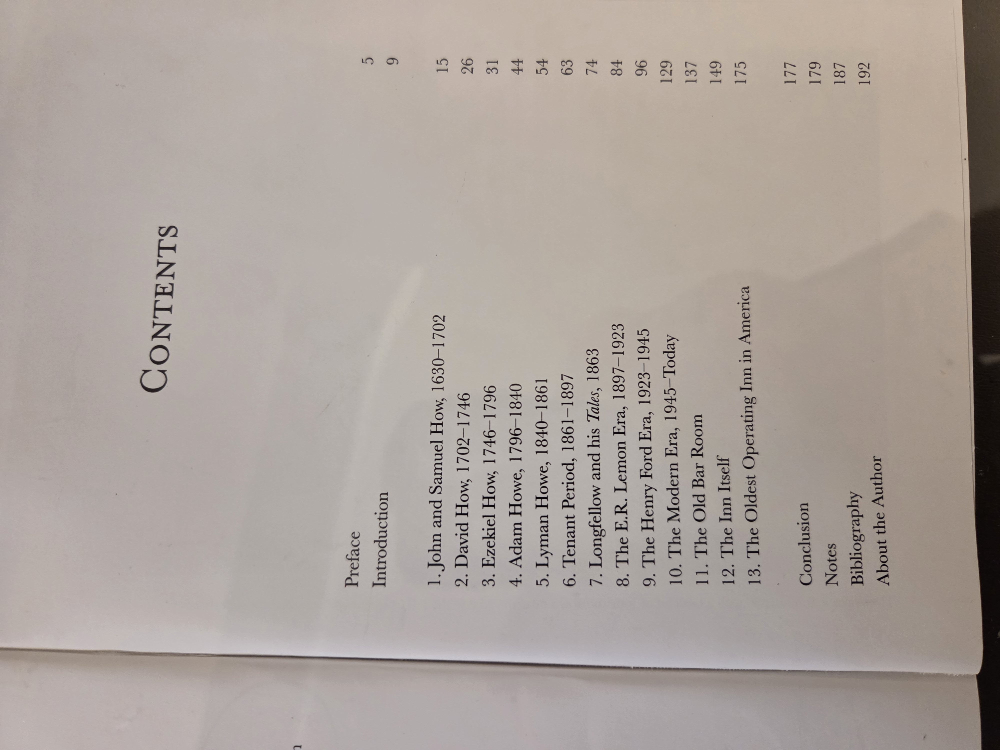
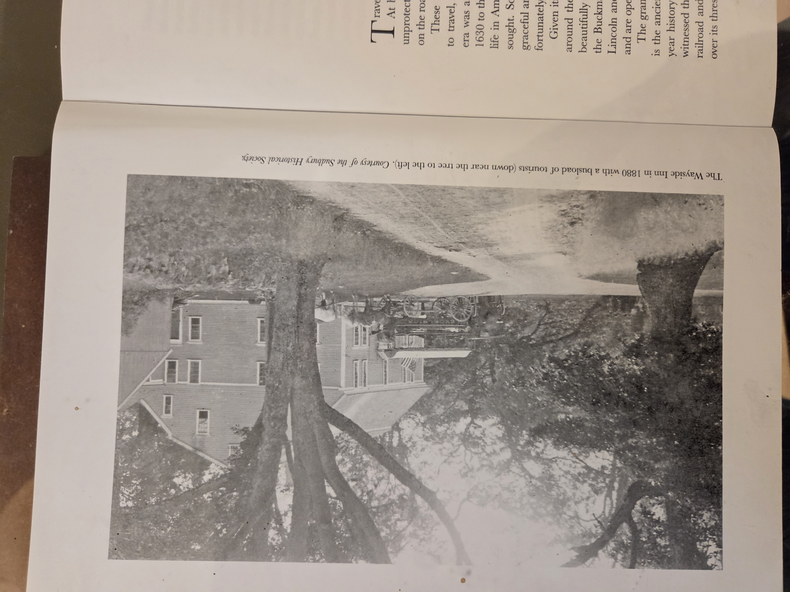

# A History of Longfellow’s Wayside Inn

**Author:** Brian E. Plumb  
**Publisher:** The History Press  
**Imprint:** None listed  
**Publication Year:** 2011  
**ISBN:** 978-1-60949-396-7  
**Library of Congress Control Number:** 2011037865  
**Place of Publication:** Charleston, South Carolina  
**Printer Location:** United States of America  

## UBC Classification

**Primary Category:** Local History, Hospitality History  
**Keywords:**  
- Wayside Inn — Sudbury, Massachusetts  
- Historic inns — United States  
- Hospitality industry — Massachusetts  
- Longfellow and literature-related landmarks  
- New England tourism history  

---

📘 Click to display copyright page (optional)

📑 Click to display table of contents (optional)

🖼️ Click to display historical image (optional)

