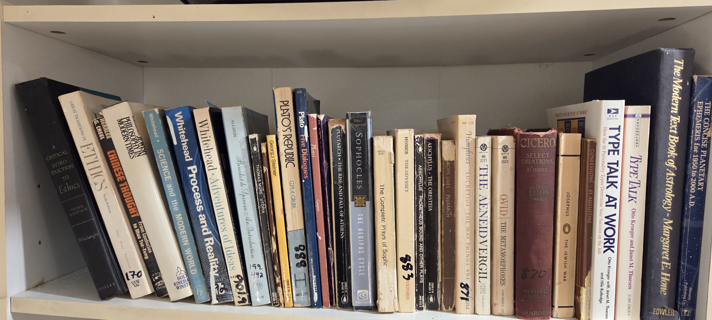

# BookCase 02 — Shelf 01 (Philosophy and Classics)

*Location:* `BookCase02 / Shelf01`  
*Scope:* Reference-heavy Philosophy and Classics

---

## Quick links to volumes (left-to-right by shelf ID)

### S01-001 … S01-004 : Ethics and Comparative Philosophy
- **S01-001 —** : A Critical Introduction to Ethics
- **S01-002 —** : Great Traditions in Ethics
- **S01-003 —** : Chinese Thought
- **S01-004 —** : Jewish Philosophy in Modern Times

### S01-005 … S01-011 : Theory of Knowledge and Medieval Philosophy
- **S01-005 —** : Science and the Modern World
- **S01-006 —** : Process and Reality
- **S01-007 —** : Adventures of Ideas
- **S01-008 —** : Benedict di Spinoza - An Introduction
- **S01-009 —** : Utopia
- **S01-010 —** : 
- **S01-011 —** : 

### S01-012 … S01-021 : Greek Classical Literature
- **S01-011 —** : Plato's Republic
- **S01-012 —** : Plato Five Dialogues
- **S01-013 —** : Plato's Republic
- **S01-014 —** : Plato Gorgias
- **S01-015 —** : Plato Crito
- **S01-016 —** : Plutarch Rise and Fall of Athens
- **S01-017 —** : Sophocles: The Oedipus Cycle
- **S01-018 —** : The Complete Plays of Sophocles
- **S01-019 —** : Homer: The Odyssey
- **S01-020 —** : Aeschylus: Andromanche and Other Plays
- **S01-021 —** : Aeschylus: The Oreistia
- **S01-022 —** : Plutarch's Lives

### S01-023 … S01-028 : Roman Classical Literature
- **S01-023 —** : Lucretius: The Way Things Are
- **S01-024 —** : Vergil: The Aeneid
- **S01-025 —** : Ovid: Metamorphoses
- **S01-026 —** : Cicero: Select Orations
- **S01-027 —** : Josephus: The Jewish War
- **S01-028 —** : St. Augustine: Confessions

### S01-029 … S01-032 : Occult and Pseudoscience
- **S01-029 —** : Type Talk at Work
- **S01-030 —** : Type Talk
- **S01-031 —** : Modern Text Book of Astrology
- **S01-032 —** : Concise Planetary Ephemeris 1950 to 2000 AD
