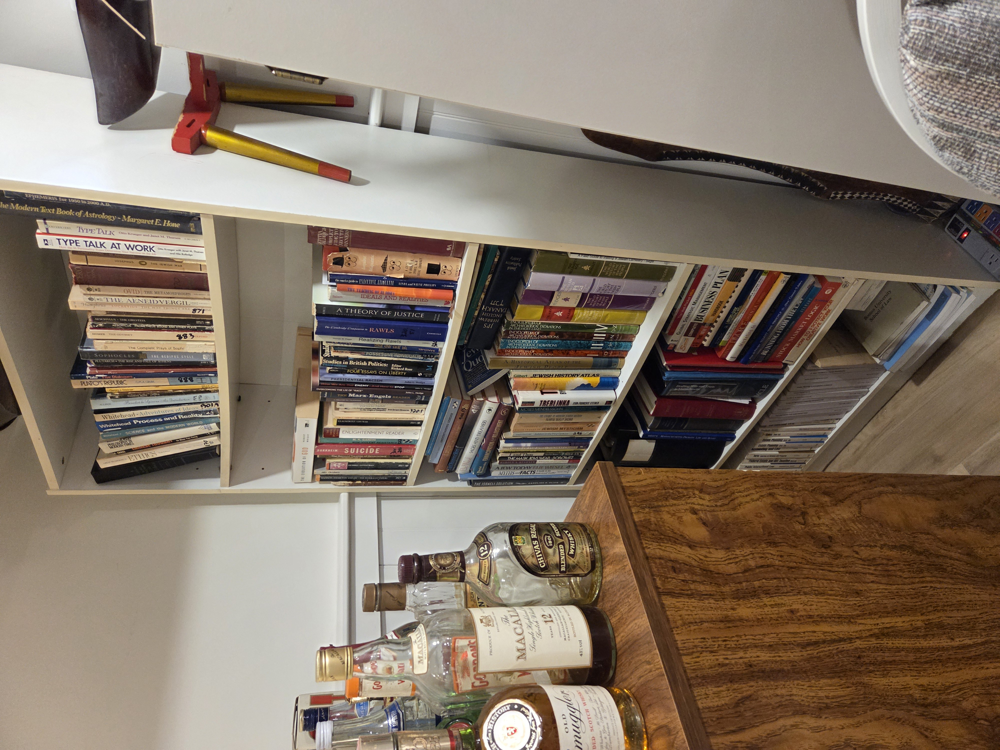

# BookCase 02 (Humanities, Law, and Business)

*Location:* `BookCase02`  
*Scope:* Philosophy and Classics

## Shelf00: Passover Haggadahs

## Shelf01: Philosophy, Classics, and Occult
### S01-001 … S00-004 : Ethics and Comparative Philosophy
### S01-005 … S01-011 : Theory of Knowledge
### S01-012 … S01-021 : Greek Classical Literature
### S01-022 … S01-029 : Roman Classical Literature
### S01-030 … S01-033 : Occult and Pseudoscience

