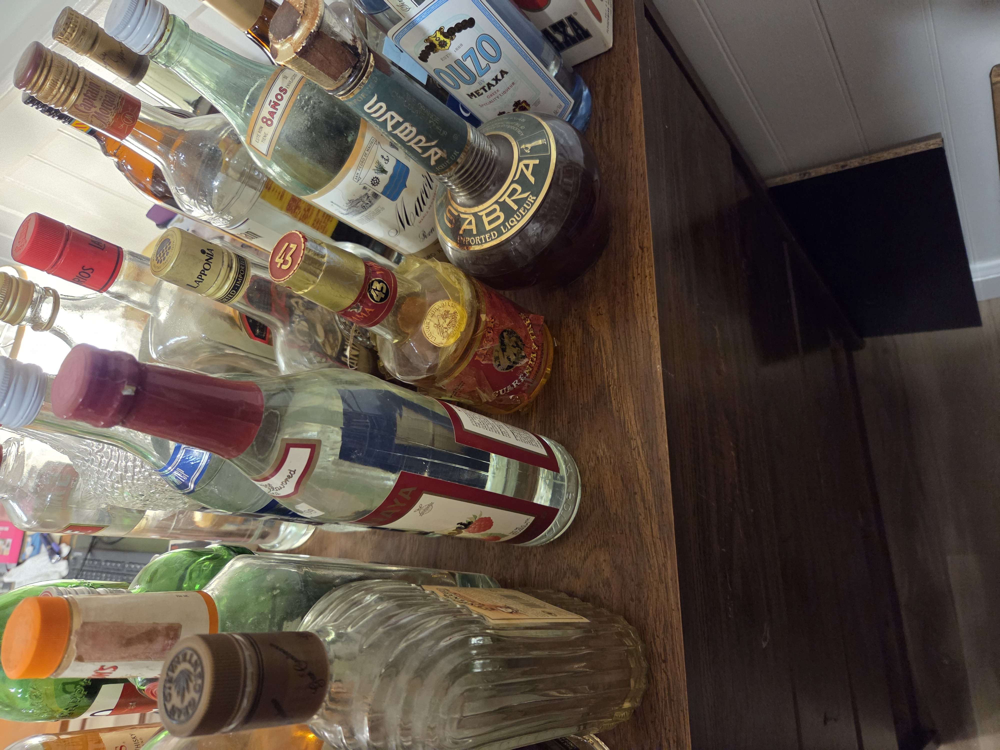

## BookCase02: Books from Upstairs Bedrooms->
  

  
!### Shelf01: Daniel's Bedroom Books → [Index](Shelf01/index.md)
#### S01-001 : The African Trilogy
#### S01-002 : Isaac Asimov: The Complete Stories
#### S01-003 : Insight Guides: Boston
#### S01-004 : Zlaty's Diary
#### S01-005 : The Way Things Work
#### S01-006 : Impressionism: Cezanne and Toulouse-Lautrec
#### S01-007 : Zinn: People's History of the United States
#### S01-008 : ... Techniques
#### S01-009 : The Swahili
#### S01-010 : Gilbert and Sullivan: Complete Operas

  
### Shelf02: Bill's Bedroom Books → [Index](Shelf02/index.md)
#### S02-001 : Julius Caesar" The Civil War
#### S02-002 : Gauge Field Theory
#### S02-003 : Quantum Fields
#### S02-004 : Classical Mechanics
#### S02-005 : Black Holes, White Dwarves, and Neutron Stars
#### S02-006 : A History of Ethiopia, Nubia and Abyssinia Vol. 1
#### S02-007 : Feynmann: Theory of Fundamental Processes 
#### S02-008 : Gautrek's Saga
#### S02-009 : The Forest Unseen
#### S02-010 : Tales from the Decameron
#### S02-011 : A History of the World in 6 Glasses
#### S02-012 : Arendt: The Origins of Totalitarianism 
#### S02-013 : Whitehead: The Underground Railroad
#### S02-014 : Mukherjee: The Emperor of All Maladies
#### S02-015 : Gumah: Paradise
#### S02-016 : Into the American Woods

  
### Shelf03: Pam's Bedroom Books → [Index](Shelf03/index.md)
#### S03-001 : Why am I so Anxious?
#### S03-002 : The Warmth of Other Suns
#### S03-003 : Angels at the Table
#### S03-004 : Tishby: Israel
#### S03-005 : Morris: Three Sisters
#### S03-006 : Michelle Obama: The Light We Carry
#### S03-007 : Lahiri: Interpreter of Maladies 
#### S03-008 : Balson: Once We Were Brothers
#### S03-009 : Diamant: Day After Night
#### S03-010 : Fragments of Sappho
#### S03-011 : Sullivan: The Cliffs
#### S03-012 : Wex: Born to Kvetch 
#### S03-013 : Biden: Promise Me, Dad
#### S03-014 : Fortune: One Golden Summer
#### S03-015 : Ware: The Lying Game
#### S03-016 : Cuddy: Presence