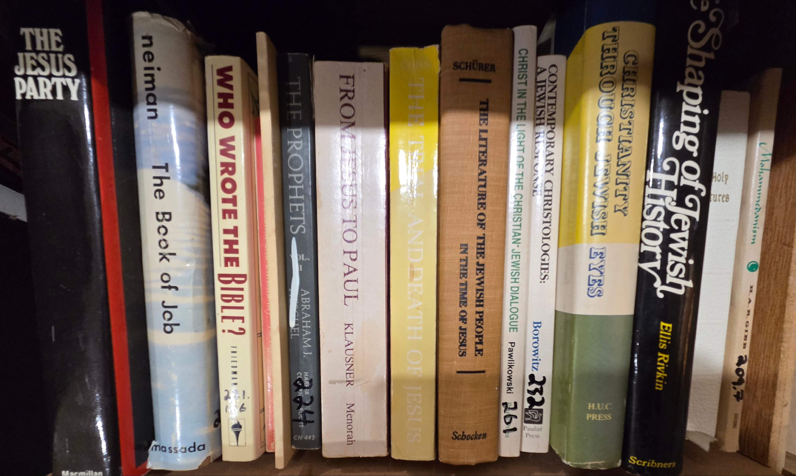
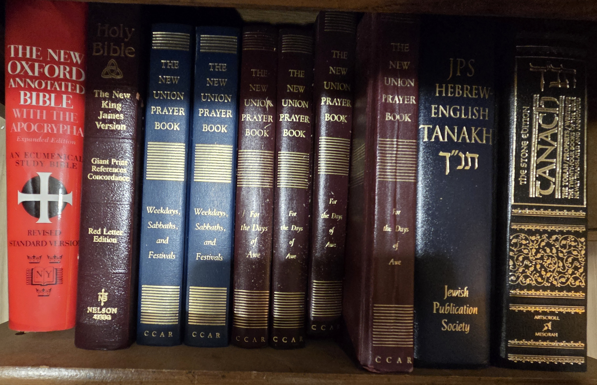

## BookCase04: Religion and Sacred Texts->
  

  
### Shelf01: Religion → [Index](Shelf0/index.md)
#### S01-001 : The Jesus Party
#### S01-002 : The Book of Job
#### S01-003 : Who wrote the Bible?
#### S01-004 : 
#### S01-005 : 
#### S01-006 : The Prophets
#### S01-007 : From Jesus to Paul
#### S01-008 : The Trial and Death of Jesus
#### S01-009 : The Literature of the Jewish People in the Time of Jesus
#### S01-010 : Christ in the Light of the Christian-Jewish Dialogue
#### S01-011 : Contemporary Christologies: A Jewish Response
#### S01-012 : Christianity Through Jewish Eyes
#### S01-013 : The Shaping of Jewish History
#### S01-014 : Holy Scriptures
#### S01-015 : Mohammedanism

  
### Shelf02: Sacred Texts → [Index](Shelf02/index.md)
#### S02-001 : The New Oxford Annotated Bible with the Apocrypha
#### S02-002 : The New King James Bible 
#### S02-003 : The New Union Prayer Book: Weekdays, Sabbaths, and Festivals
#### S02-004 : The New Union Prayer Book: Weekdays, Sabbaths, and Festivals
#### S02-005 : The New Union Prayer Book: For the Days of Awe
#### S02-006 : The New Union Prayer Book: For the Days of Awe
#### S02-007 : The New Union Prayer Book: For the Days of Awe
#### S02-008 : The New Union Prayer Book: For the Days of Awe
#### S02-009 : JPS Hebrew-English Tanakh 
#### S02-002 : The Stone Edition Tanakh