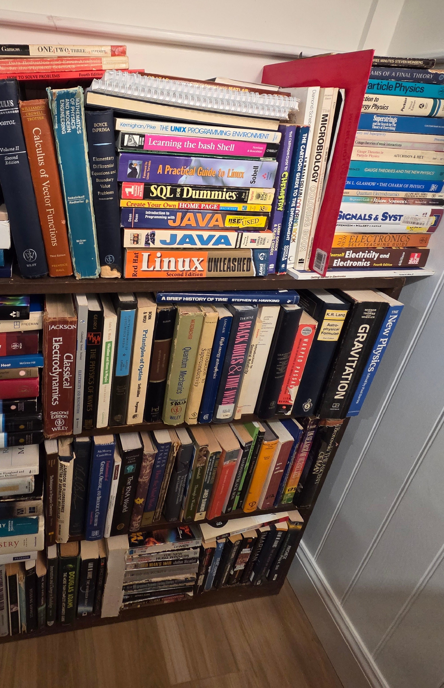
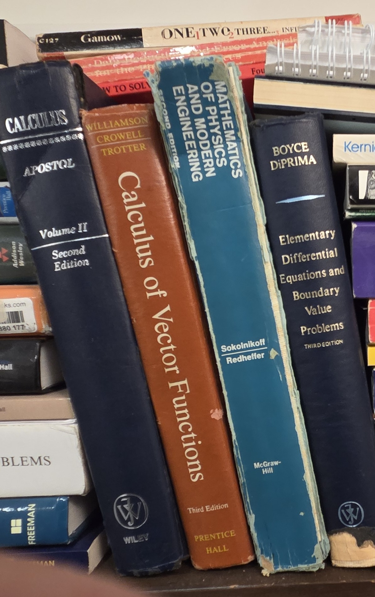
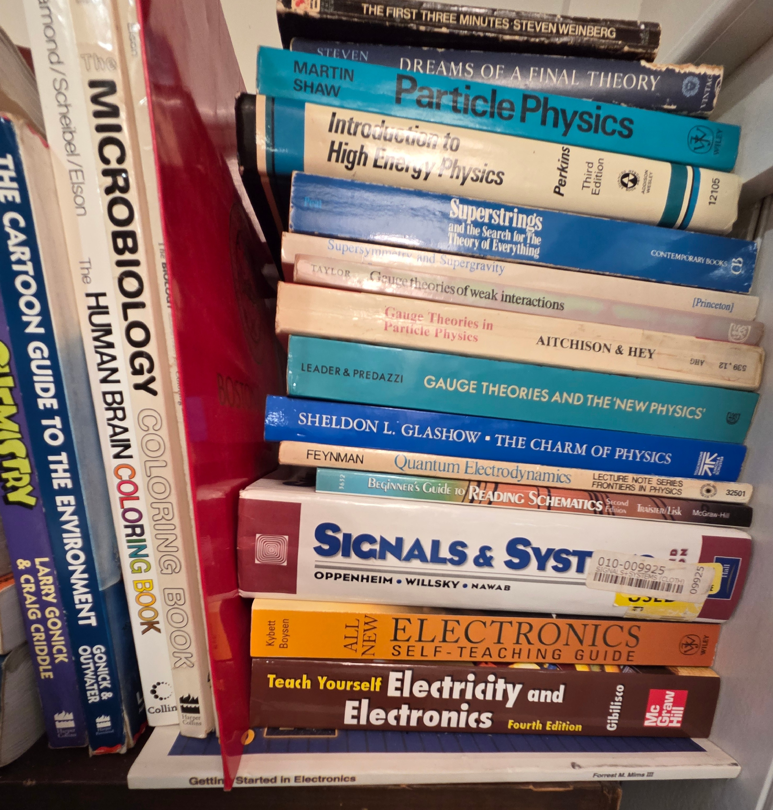
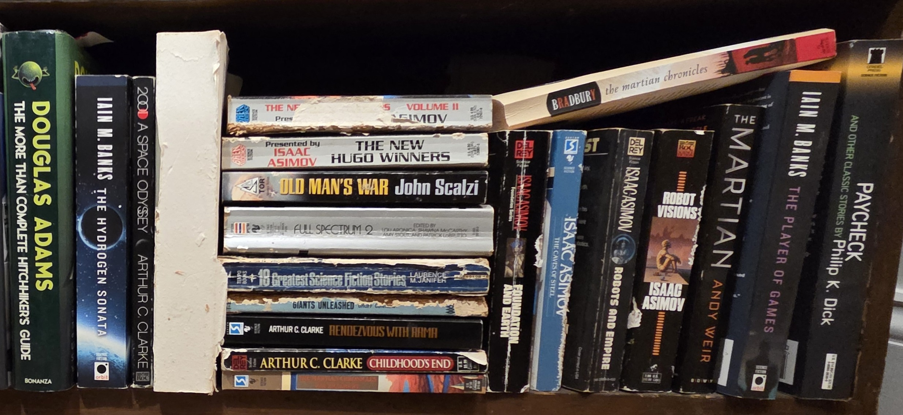

## BookCase05: *Scope:* Science and Mathematics->
  

  
### Shelf00: Mathematics → [Index](Shelf00/index.md)

   
### Shelf01: Computer Science → [Index](Shelf01/index.md)

  
### Shelf02: Cartoon Science, Electronics, and Particle Physics → [Index](Shelf02/index.md)

  
### Shelf03: Physics → [Index](Shelf03/index.md)

  
### Shelf04: Biology and Physical Anthropology → [Index](Shelf04/index.md)

  
### Shelf05: Science Fiction → [Index](Shelf05/index.md)