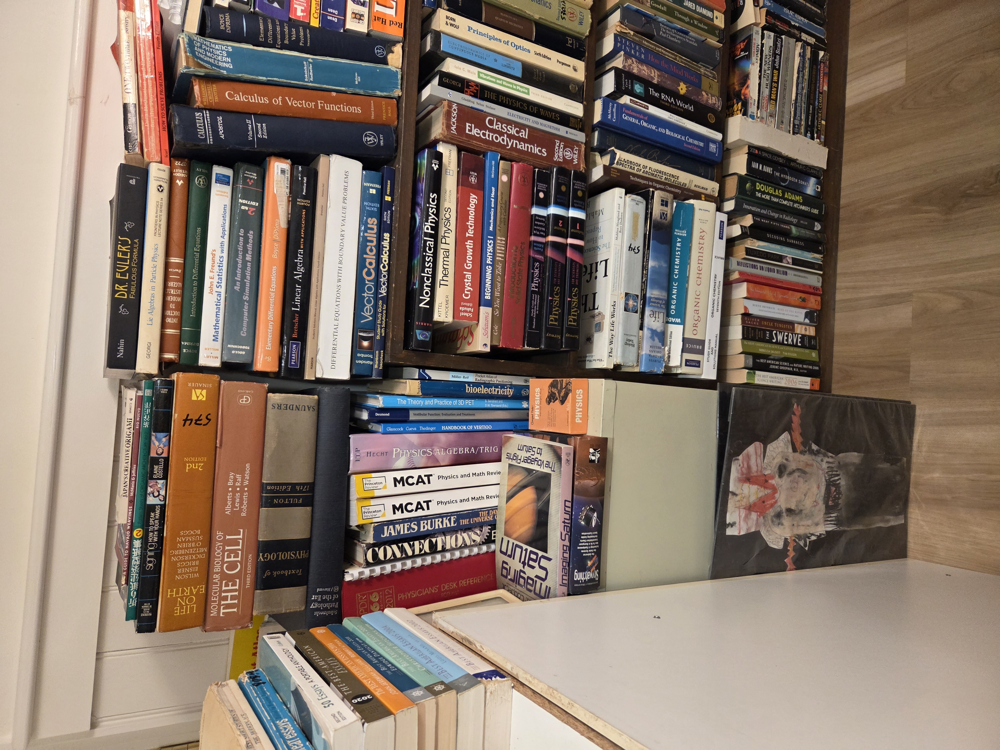
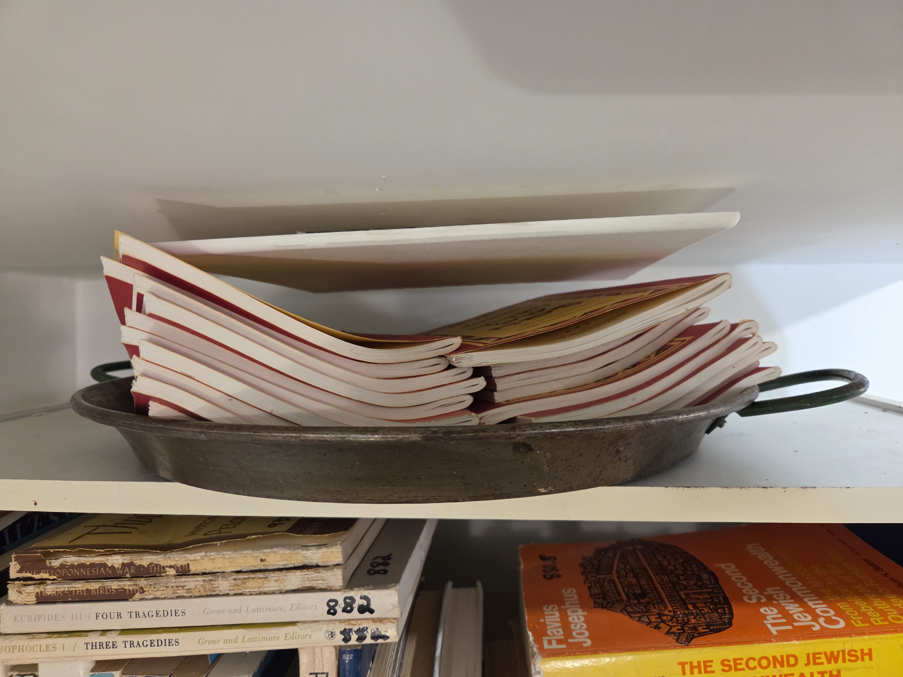
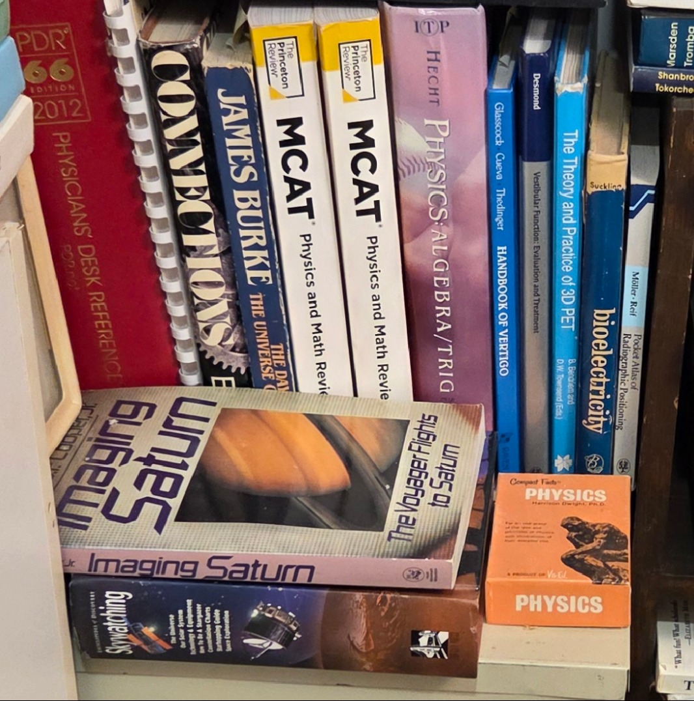
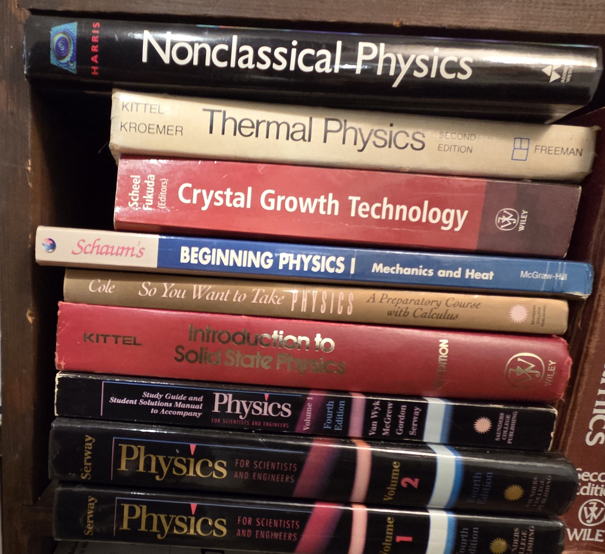

## BookCase06: Medicine, Math and Sciences->
  

  
### Shelf00: Biology, Physiology, and Oversize→ [Index](Shelf00/index.md)

  
### Shelf01: Medicine, Imaging, and Technology History → [Index](Shelf01/index.md)

  
### Shelf02: Mathematics, Statistics and Math History → [Index](Shelf02/index.md)

  
### Shelf03: Physics → [Index](Shelf03/index.md)

  
### Shelf04:Chemistry and Biology → [Index](Shelf04/index.md)

  
### Shelf05: Science and Medicine History and Writing → [Index](Shelf05/index.md)
eferences
