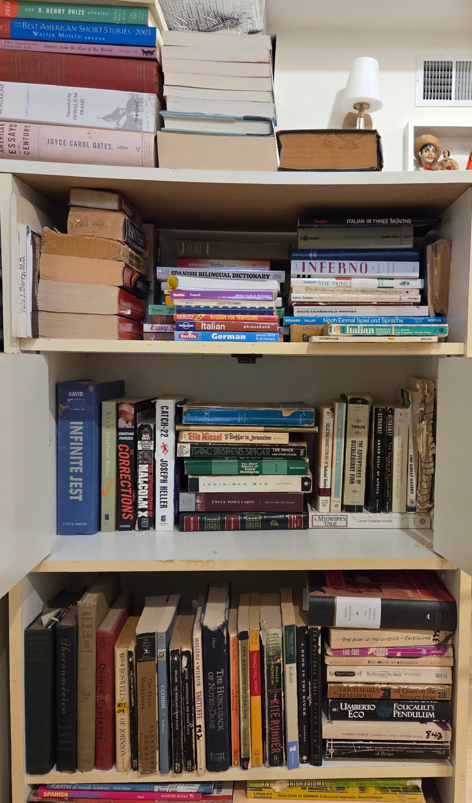
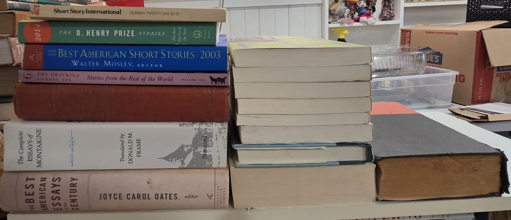
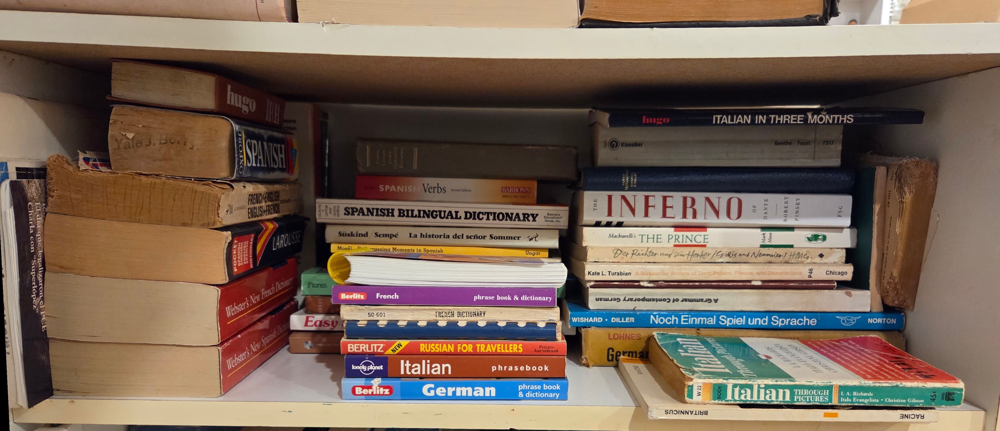
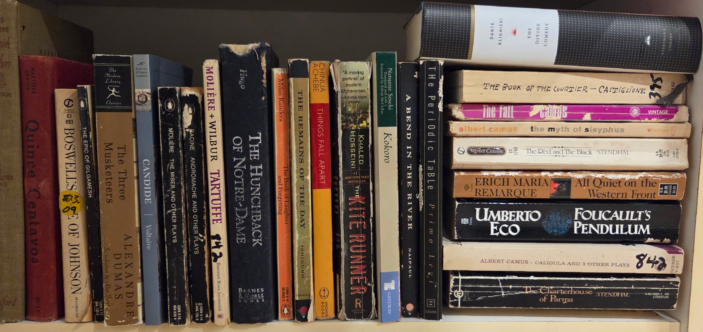

## BookCase08: Languages and Literature->
  

  
  
  
### Shelf00: Short Story, Essay, and Poetry Anthologies → [Index](Shelf00/index.md)

  
### Shelf01: Spanish, Italian, French and German → [Index](Shelf01/index.md)

  
### Shelf02: English and American English Literature → [Index](Shelf02/index.md)

  
### Shelf03: Shelf03: Spanish, French, and Italian Literature → [Index](Shelf03/index.md)

  
### Shelf04: Shelf04: Workbooks, Study Guides, and Hebrew → [Index](Shelf04/index.md)

