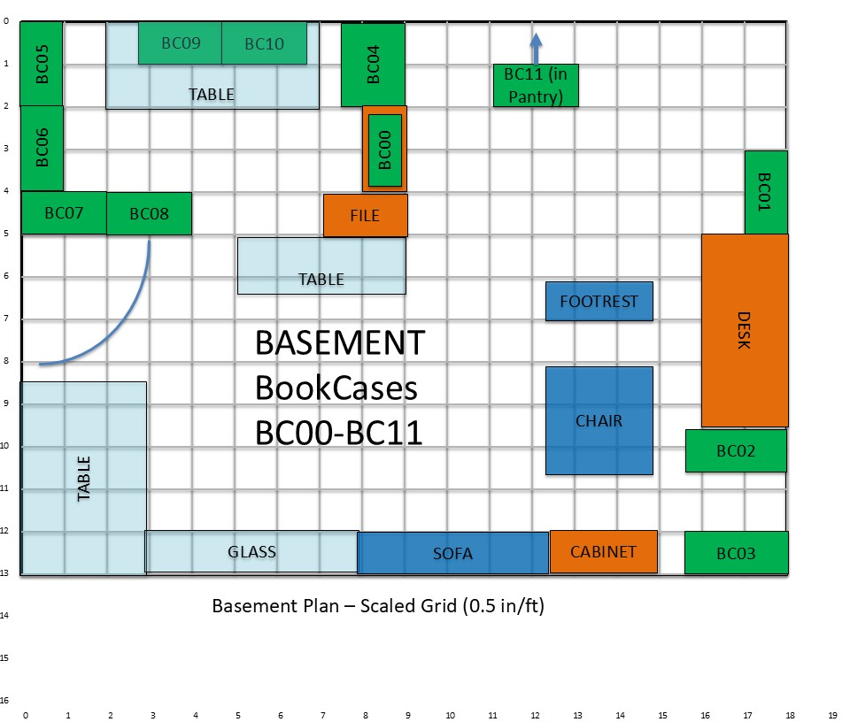

# WorstellBerry Library

Welcome! This site is a personal, searchable catalog of the Worstell/Berry home library.

Use the links below to browse by **location** (bookcase/shelf). You can also use the
search box in the header to jump straight to a title, author, ISBN, or note.

---

  

## Browse by Location

### BookCase01: History and Travel → [Index](books/BookCase01/index.md)
#### Shelf01: US History → [Index](books/BookCase01/Shelf01/index.md)
#### Shelf02: World History → [Index](books/BookCase01/Shelf02/index.md)
#### Shelf03: Various Early History and Mid to Late 20th US Politics → [Index](books/BookCase01/Shelf03/index.md)
#### Shelf04: Travel and International History → [Index](books/BookCase01/Shelf04/index.md)

### BookCase02: BookCase02: Books from Upstairs Bedrooms → [Index](books/BookCase02/index.md)
#### Shelf01: Daniel's Bedroom Books 
#### Shelf02: Shelf02: Bill's Bedroom Books 
#### Shelf03: Pam's Bedroom Books 

### BookCase03: Philosophy, Religion, Law and Business → [Index](books/BookCase03/index.md)
#### Shelf00: Passover Haggadah
#### Shelf01: Philosophy, Greek and Latin Classics, and Occult Pseudoscience
#### Shelf02: Social Sciences, Justice, and Etiquette
#### Shelf03: Jewish Thought, Politics and History
#### Shelf04: Massachusetts Law and Business
#### Shelf05: Law Summaries and References

### BookCase04: Religion and Sacred Texts → [Index](books/BookCase04/index.md)
#### Shelf01: Religion
#### Shelf02: Sacred Texts

---

## Plans / Roadmap

- **UDC browsing tabs** (grouping items by classification ranges)
- “Related volumes on this shelf” cross-links
- Provenance notes where applicable

---

## Conventions

- Dimensions are approximate when taken from ruler photos.  
- Condition notes are brief and pragmatic (e.g., *“Fair; torn dust jacket”*).  
- If a page says “coming soon,” the record exists in the spreadsheet but the
  Markdown page isn’t written yet.

